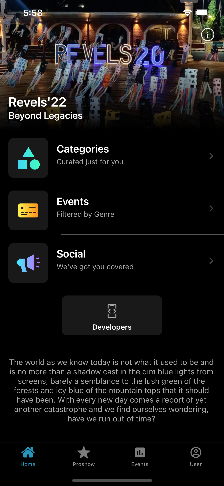
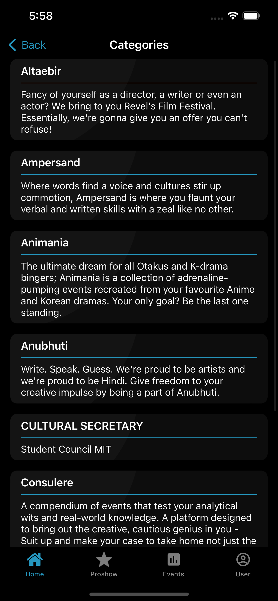
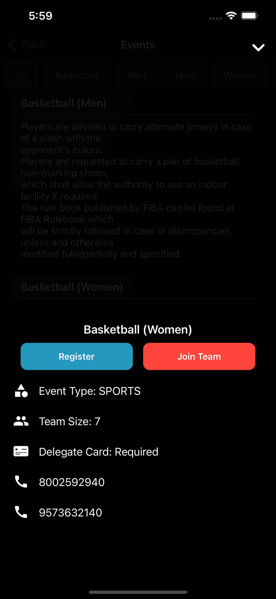
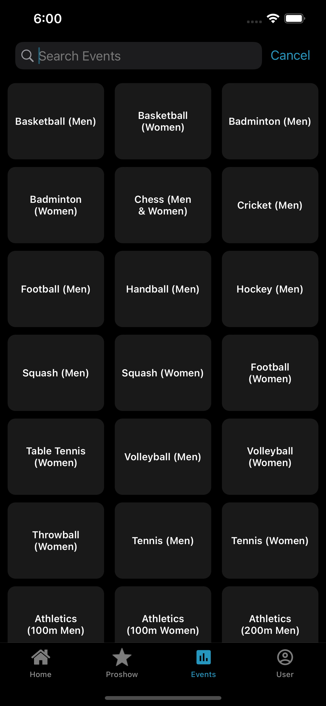
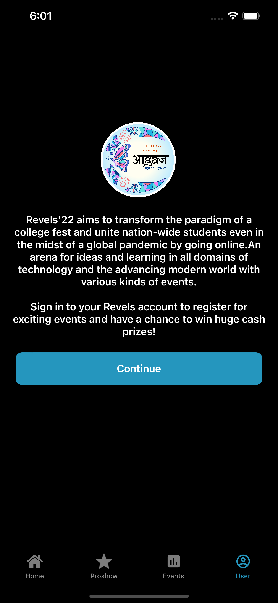
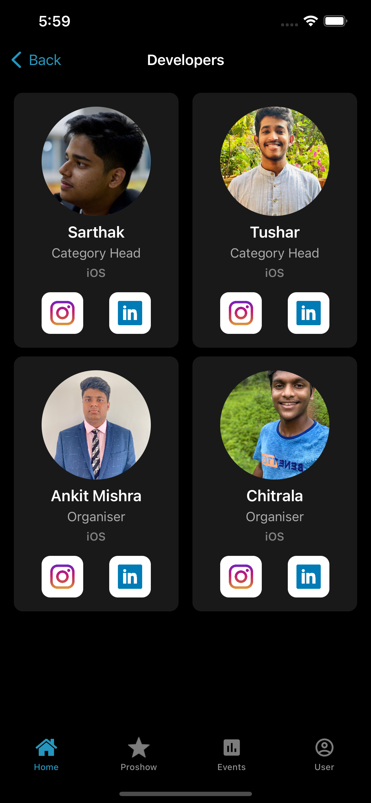
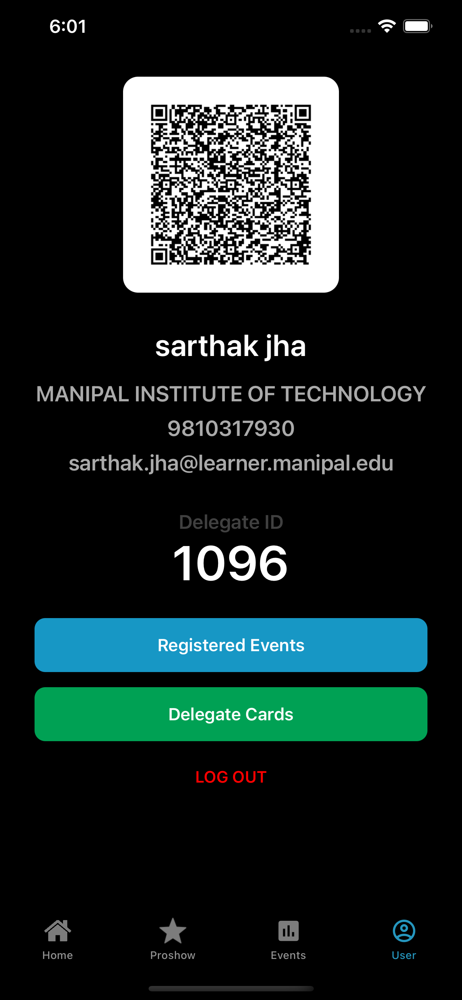
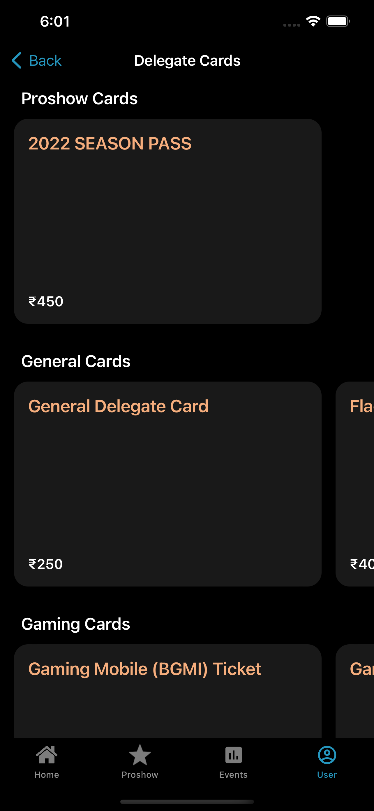
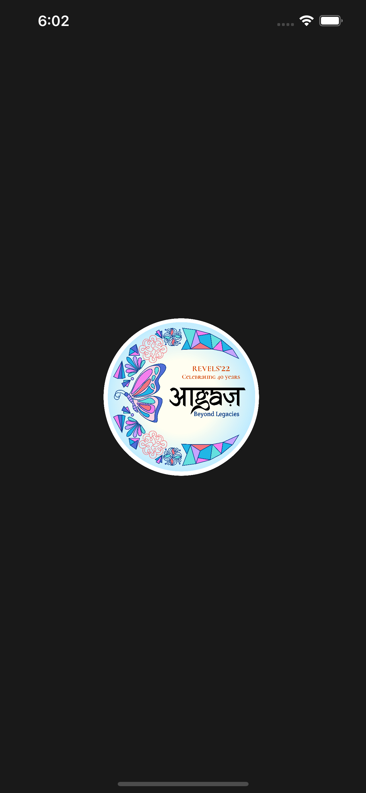

# Revels'22

The official iOS Application for the National Fest of Manipal Institute of Technology.
<br>
**Revels 2022**

---

### Screenshots

<p float="left">










</p>


### Installation ⚡️

1. Clone the repo via git clone command.
```
https://github.com/naman17/Revels.git
```
2. Run the following command to install all the third-party libraries.
```
pod install
```
3. Open in Xcode
```
open Revels-20.xcworkspace
```
```
Build and Run
```
Server Access Token

```
**Server Access Token**
contact the developer for the token key
replace token in Secrets.swift
```


### Download 📦
App is available on App Store. You can donwload on your iOS device from [here](https://apps.apple.com/in/app/revels22/id1500173604).


### Developer Partners 👨🏻‍💻
- [Sarthak Jha](https://github.com/sarthakjha)
- [Tushar Elangovan](https://github.com/tushar0509)

